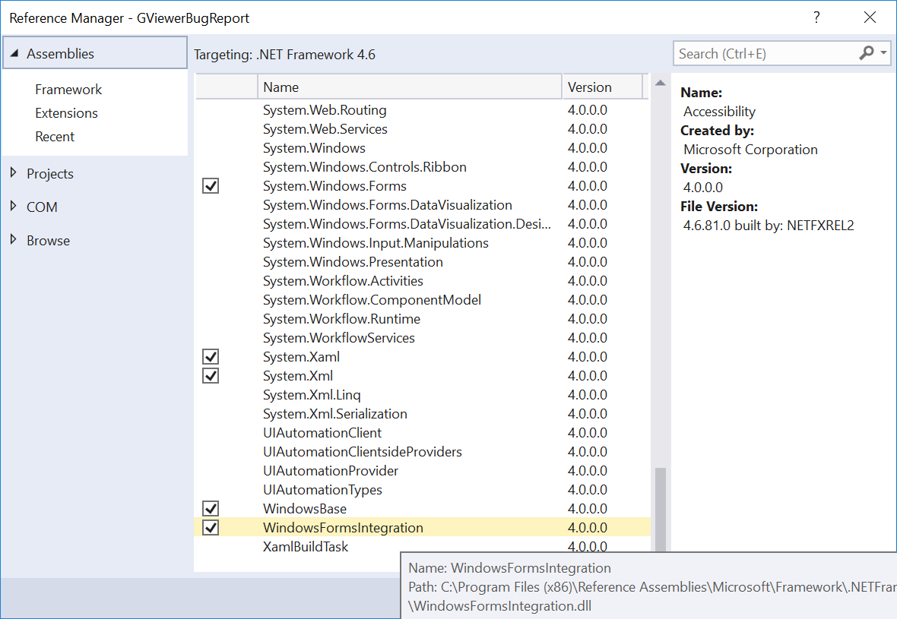
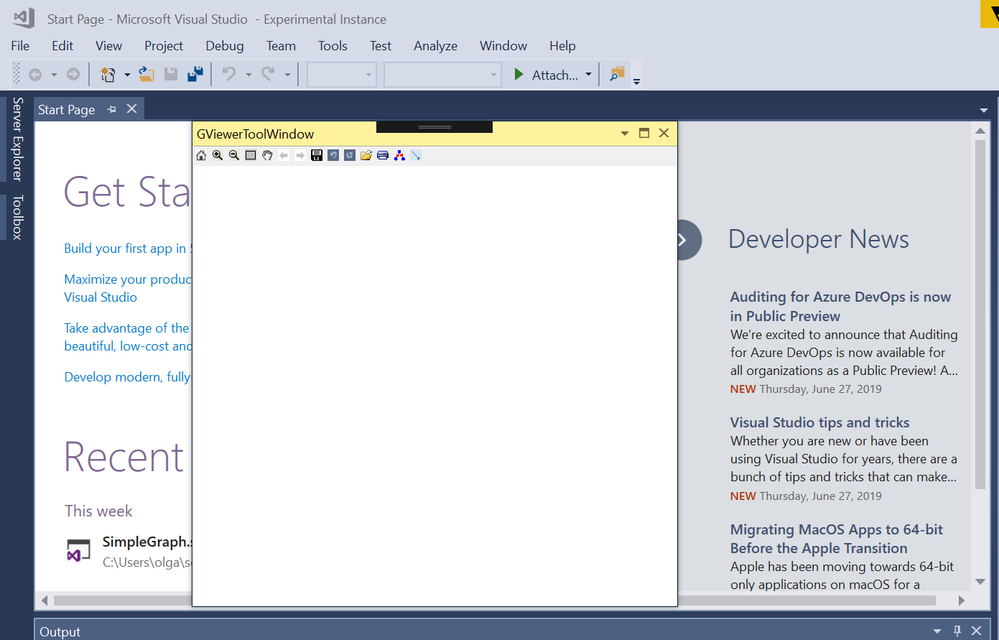

# Graph inside GViewer hosted in WPF doesn't appear in the custom tool window in VSIX extension

I'm developing Visual Studio extension and I want to use MSAGL library for graph rendering. I'm trying to [host it in WPF](https://social.msdn.microsoft.com/Forums/office/en-US/b8b3c8bd-13ae-4ade-8b11-940aa7a39837/using-glee-with-wpf?forum=automaticgraphlayout) and add it to custom tool window, but the graph isn't displayed inside the window. Here are the steps to reproduce this bug.

1. Open Visual Studio

2. Create VSIX project with the tool window, name it *GViewerToolWindow.cs* https://docs.microsoft.com/en-us/visualstudio/extensibility/creating-an-extension-with-a-tool-window?view=vs-2019

3. Add MSAGL NuGet package

4. Add these lines to *Properties/AssemblyInfo.cs*

   ```c#
   [assembly: ProvideCodeBase(CodeBase = @"$PackageFolder$\Microsoft.Msagl.GraphViewerGdi.dll")]
   [assembly: ProvideCodeBase(CodeBase = @"$PackageFolder$\Microsoft.Msagl.dll")]
   [assembly: ProvideCodeBase(CodeBase = @"$PackageFolder$\Microsoft.Msagl.Drawing.dll")]
   ```

   

5. Add WindowsFormsIntegration assembly reference

6. Remove default button control from GViewerToolWindowControl.xaml and add WindowsFormsHost control named Wfh. The xaml code should be similar to 

   ```xaml
   <UserControl x:Class="GViewerBugReport.GViewerToolWindowControl"
                xmlns="http://schemas.microsoft.com/winfx/2006/xaml/presentation"
                xmlns:x="http://schemas.microsoft.com/winfx/2006/xaml"
                xmlns:mc="http://schemas.openxmlformats.org/markup-compatibility/2006"
                xmlns:d="http://schemas.microsoft.com/expression/blend/2008"
                xmlns:vsshell="clr-namespace:Microsoft.VisualStudio.Shell;assembly=Microsoft.VisualStudio.Shell.15.0"
                Background="{DynamicResource {x:Static vsshell:VsBrushes.WindowKey}}"
                Foreground="{DynamicResource {x:Static vsshell:VsBrushes.WindowTextKey}}"
                mc:Ignorable="d"
                d:DesignHeight="300" d:DesignWidth="300"
                Name="MyToolWindow">
       <Grid>
           <StackPanel Orientation="Vertical">
              <WindowsFormsHost x:Name="Wfh"></WindowsFormsHost>
           </StackPanel>
       </Grid>
   </UserControl>
   
   ```

   

7. Add this method to GViewerToolWindowControl.xaml.cs 

   ```c#
   private Graph CreateGraph()
   {
         Graph graph = new Graph("graph");
         //create the graph content 
         graph.AddEdge("A", "B");
         graph.AddEdge("B", "C");
         graph.AddEdge("A", "C").Attr.Color = Color.Green;
         graph.FindNode("A").Attr.FillColor = Color.Magenta;
         graph.FindNode("B").Attr.FillColor = Color.MistyRose;
         Node c = graph.FindNode("C");
         c.Attr.FillColor = Color.PaleGreen;
         c.Attr.Shape = Shape.Diamond;
         return graph;
   }
   ```

   

8. Add to constructor, after `InitializeComponent();` the following code 

   ```c#
    var graph = CreateGraph();
    var gViewer = new GViewer {Graph = graph};
    Wfh.Child = gViewer;
   ```

   

9. Start Visual Studio experimental instance. Select *View/Other windows/GViewerToolWindow*. The window with GViewer doesn't contain the graph. 


